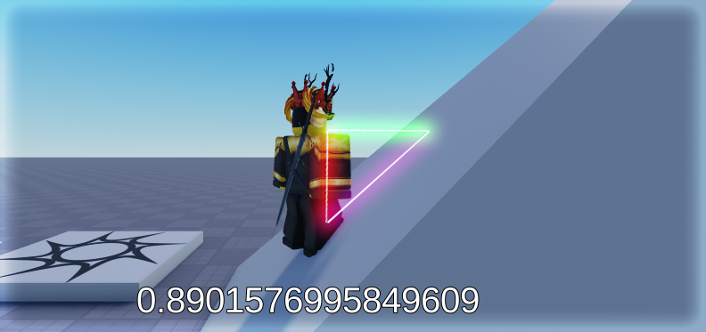

# SlopeDetector
Open source solution to detect slopes in front of a BasePart.

Build the place using Rojo. You may need to set up some obstacles to properly test it. To implement in your game, copy the "DetectSlope.luau" file and set DEBUG_MODE to false.
